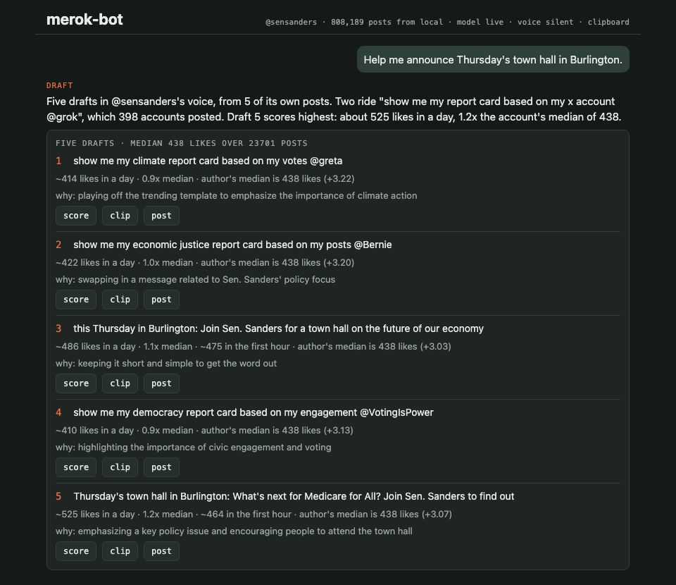
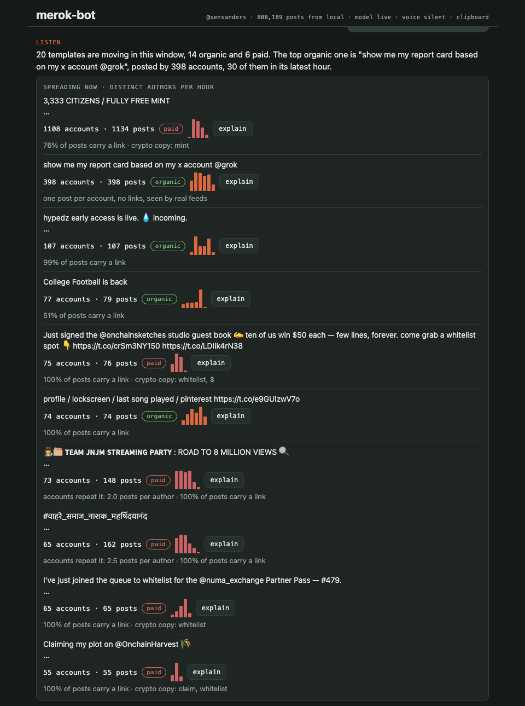
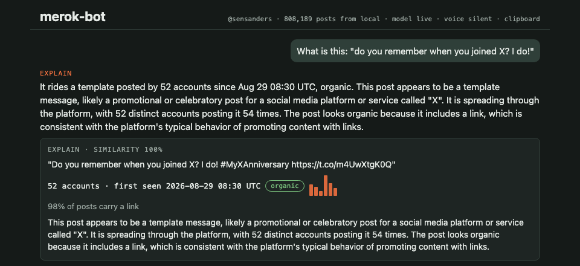
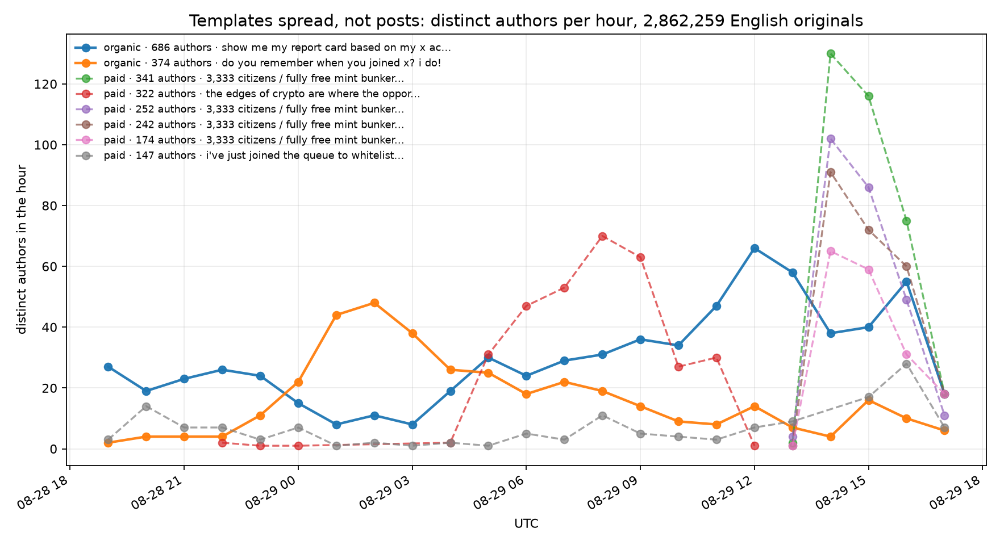

<h1 align="center">merok-bot</h1>

<p align="center">
  <strong>A chat assistant that helps you post things that spread, and shows its work.</strong>
</p>

<p align="center">
  Developed for the Best Memetics Hack track at <a href="https://hophacks-fall-2026.devpost.com/">HopHacks 2026</a>,
  Johns Hopkins University, September 18 to 20, 2026, on datasets provided by
  <a href="https://www.calcifercomputing.com/hophacks">Calcifer Computing</a>.
</p>

<p align="center">
  <a href="https://github.com/HackedRico/merok-bot/actions/workflows/ci.yml"></a>
  
  
  
</p>

---

<p align="center">
  
</p>

## What it is

Anyone who posts for a living knows the feeling: some posts travel and most do not, and the
platform never says why. merok-bot is built on one observation from a month of the X
firehose: **the thing that spreads is not the post, it is the template**, a text pattern
that many accounts fill in. In a single hour, thirty distinct texts were posted word for word
by five or more accounts. The biggest one reached 686 accounts in a day.

merok-bot watches the firehose for templates that are spreading right now, tells the organic
ones apart from paid replication by looking at the accounts behind them, writes five posts in
your own voice from your own past posts, predicts how each will do against your usual numbers
and says why, turns one into a captioned clip, posts it, and shows you the curve afterwards.

You use it by talking to it. Every button in the app sends a sentence you could have typed.

## See it in five minutes

You need [uv](https://docs.astral.sh/uv/), Node 22 and [ffmpeg](https://ffmpeg.org/).

**1. Install**

```bash
git clone https://github.com/HackedRico/merok-bot && cd merok-bot
uv sync
cp .env.example .env
```

**2. Add a model (optional).** Any OpenAI-compatible endpoint works. Without one the app
still runs, with drafts marked as placeholders.

```bash
# in .env
MEROK_LLM_BASE_URL=https://api.featherless.ai/v1
MEROK_LLM_API_KEY=your-key
MEROK_LLM_MODEL=unsloth/Meta-Llama-3.1-8B-Instruct
```

**3. Pull one day of data.** About four minutes; nothing is downloaded whole.

```bash
uv run python scripts/pull_month.py --from 290 --to 313
```

**4. Start the API, then the app**, in two terminals:

```bash
uv run uvicorn api.main:create_app_from_env --factory --port 8000
```

```bash
cd app && npm install && npx expo start --web
```

Open http://localhost:8081 and click "What are people posting this hour?".

## What you can ask

| Say | What happens |
|---|---|
| What are people posting this hour? | The templates replicating right now, each with its curve of distinct accounts per hour and a verdict, organic or paid, with the reasons |
| What is this: "..." | Which template a pasted post rides, when it was first seen, who started it, and a plain explanation written only from those facts |
| Help me announce Thursday's town hall. | Five posts in the account's voice, drawn from its own history, two of them riding a live template |
| score draft 2 | Predicted likes in a day against the account's median, with the drivers that moved the number |
| turn draft 3 into a clip | A captioned 9:16 clip ready for TikTok, in about five seconds |
| post the third one | Posted to X inside a spend cap, or copied to the clipboard for platforms that lock apps out |
| How did it do? | The real curve against the forecast |

<p align="center">
  
  &nbsp;
  
</p>

## The findings

**Templates spread, not posts.** Distinct accounts per hour on one template is a meme's
lifecycle, drawn from data. Two organic memes ride all day below: people asking Grok for a
report card on their account, and X's join-date share card. The dashed lines are crypto copy,
hundreds of accounts in a two-hour burst. The split between them is part of the finding, never
a filter.

<p align="center">
  
</p>

**Did government learn to meme?** Measured per account and per month against the same
account's other posts, official congressional accounts did not: their use of internet formats
sits near one percent and has since 2019. The accounts that did are the White House and the
agencies, which the dataset does not include. The chart and the reasoning are in
[docs/plan.md](docs/plan.md). A null result, stated as one.

## How it works

Seven tools behind one chat. Each is a directory, each has a test that says when it is done,
and none of them imports another.

```
listen   mine the firehose for templates, curve them, split organic from paid
explain  match a pasted post to a template, gloss it from the facts
draft    retrieve the account's own posts, generate five in that voice
score    gradient boosting over log-likes, drivers by counterfactual swap
render   script, voice, background, captions, one ffmpeg pass
ship     X with OAuth 1.0a and a spend cap, or the clipboard
learn    one like-count read per ask, or a replayed firehose trajectory
```

Everything that touches the outside world sits behind a seam with a local adapter, so the
whole loop runs on one laptop with wifi off, and `/health` says which adapter each seam is on.

| Seam | Default | To change it |
|---|---|---|
| Data | the sponsor's public bucket, one hour file at a time, cached locally | `MEROK_DATA_SOURCE=fixture` for the test slice |
| Model | any OpenAI-compatible endpoint | leave unset for the offline fake |
| Embeddings | character n-gram hashing, no download | `MEROK_EMBEDDER=nomic` after `uv sync --extra nomic` |
| Voice | silent, captions still word-timed | `MEROK_VOICE=elevenlabs` with `ELEVENLABS_API_KEY` |
| Background | a drifting gradient from ffmpeg | generated stills and Veo, behind the same protocol, are next |
| Publisher | X, inside `MEROK_X_BUDGET_USD` | falls back to the clipboard until the four `X_*` credentials are set |
| Learn | one read per ask on X | falls back to replaying a real firehose trajectory |

The methods are borrowed and credited. Template curves are
[MemeTracker](https://snap.stanford.edu/memetracker/) run on X in 2026, with the organic and
paid split argued for by [Shafin and Ahmed (2026)](https://arxiv.org/abs/2609.13671).
Drafting is the [Digital Twin of Congress](https://arxiv.org/abs/2505.00006) method: a
persona prompt from retrieved exemplars, judged by a statistical Turing test. Scoring anchors
a known account to its own median and lets the model supply the multiplier, because the
firehose almost never shows accounts with thousands of likes.

## Project layout

```
shared/     types, text, embeddings, config, the data seam, the model seam
tools/      one directory per verb: listen, explain, draft, score, render, ship, learn
chat/       one message routes to one tool: rules first, the model second
api/        FastAPI, the only place that reads config
app/        Expo, one codebase for the browser and the phone
analysis/   the two charts, computed by the same functions the app calls
scripts/    data pulls, fixtures, a pressure test
tests/      fixtures cut from the bucket; nothing here touches the network
docs/       architecture, plan, prior art, pitch
```

Four Python packages at the repo root, no wrapper, and one rule that lets several people
work at once: a tool imports `shared` and nothing else in the repo. A test fails the build if
it does. [docs/architecture.md](docs/architecture.md) holds every interface and the reasons
behind the layout, and [CLAUDE.md](CLAUDE.md) holds the rules and the things about the data
that the schemas do not confess.

## Testing

```bash
uv run pytest                        # 44 tests on fixtures, no network
uv run python scripts/pressure.py    # against a running API: many conversations at once, plus hostile inputs
```

## Data

Three of the sponsor's four datasets:

- **The X firehose**, 395 million rows over a month, read one hour file at a time over HTTPS.
- **Government tweets**, 2.16 million posts by official accounts, with engagement counts.
- **TikTok**, one shard for sounds, once a Hugging Face token is at hand.

Data belongs to its sources; see Calcifer Computing's dataset page.

## Roadmap

- ElevenLabs voice on the clip, one config flip.
- A generated hero shot for the clip through Veo, pre-rendered, on free credits.
- Live posting once the X credentials exist; the adapter, the cap and the ledger are already in.
- The phone: Expo Go on a real device, with the clip's share sheet opening TikTok.

## Licence

Apache 2.0. See [LICENSE](LICENSE).
